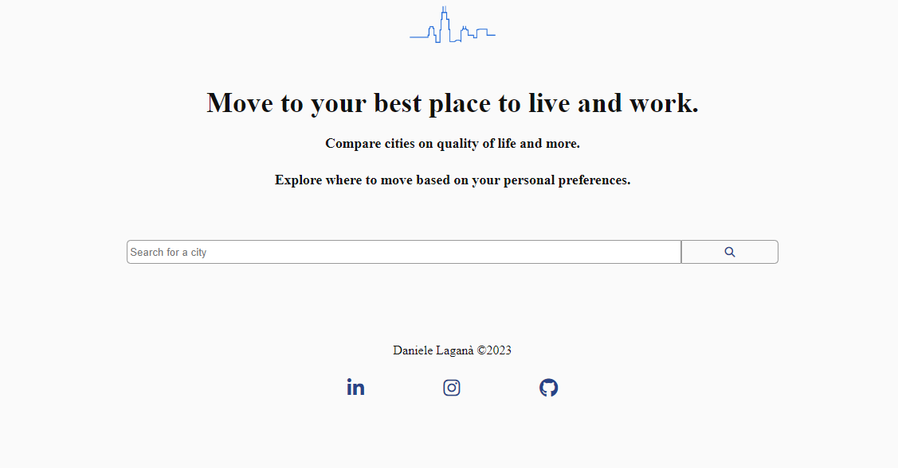

<!-- PROJECT LOGO -->
 

  
  
<h3 align="center">Quality of Life</h3>

  

A simple application where you can see different datas for a city of your choice.
      
    <a href="https://quality-of-life-cityapp.netlify.app" target="_blank"><strong>View the demo»</strong></a>
     
     
    <a href="https://github.com/Dannlgn/Quality-of-life/issues">Report Bug</a>
    ·
    <a href="https://github.com/Dannlgn/Quality-of-life/issues">Request Feature</a>
  

<!-- TABLE OF CONTENTS -->

  
Table of Contents

  <ol>
    <li>
      <a href="#about-the-project">About The Project</a>
      <ul>
        <li><a href="#built-with">Built With</a></li>
      </ul>
    </li>
    <li><a href="#usage">Usage</a></li>
    <li><a href="#external-services">External services</a></li>
    <li><a href="#contact">Contact</a></li>
  </ol>

<!-- ABOUT THE PROJECT -->

## About The Project

This project is made for the javascript advanced module of "Start2Impact University".

The purpose of this project is to check the quality of life in a city your choice, involving a request to an API to see different data scores. 

(<a href="#readme-top">back to top</a>)

### Built With

(<a href="#readme-top">back to top</a>)

<!-- USAGE EXAMPLES -->

## Usage

Just go the <a href="https://quality-of-life-cityapp.netlify.app" target="_blank">website</a> and search for a city of your interest!
 
 
Note: Cities can only be found if the request is in english. 

(<a href="#readme-top">back to top</a>)

<!-- EXTERNAL SERVICES -->

## External services

<a href="https://teleport.org">Teleport</a> API.

(<a href="#readme-top">back to top</a>)

<!-- CONTACT -->

## Contact

Daniele Laganà

- Linkedin: [@Daniele Laganà](https://www.linkedin.com/in/daniele-laganà/)
- e-mail: daniele.lgn96@yahoo.it

  
Project Link: [Quality of life app](https://github.com/Dannlgn/Quality-of-life)

(<a href="#readme-top">back to top</a>)

